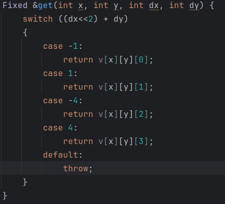
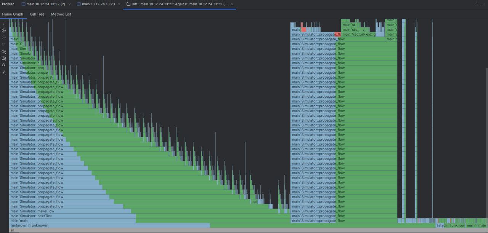
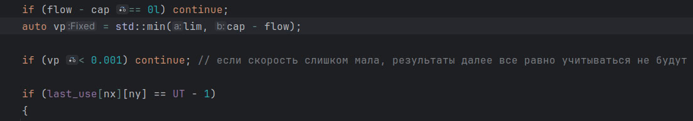
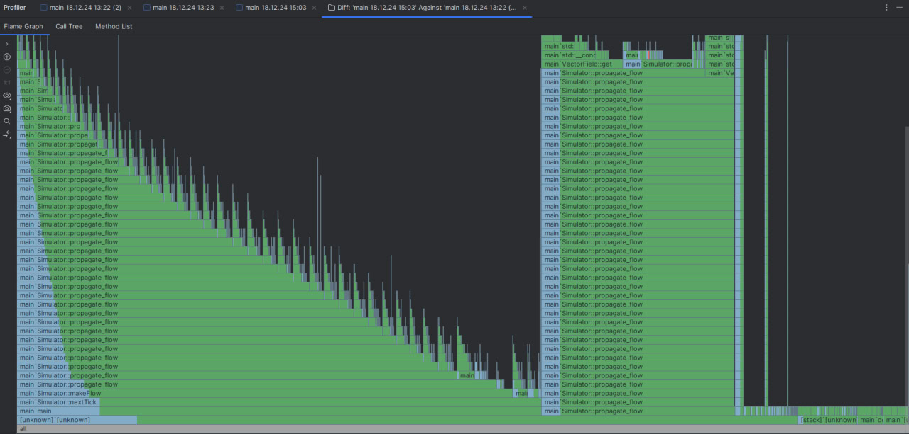

# Петров Константин Сергеевич БПИ233-2
## Большое домашнее задание 3. Симулятор жидкостей

### Реализованные вещи в решении:

1. Ускорение без использования потоков\
Профайлер показывает, что бутылочным горлышком является метод get структуры VectorField\
Такая функция, либо с использованием любого другого соответствия dx,dy и индекса существенно ускоряет программу\
   
   

Осмотрев код симулятора я пришел к выводу, что нет нужды считать ОЧЕНЬ маленькие значения скоростей, поэтому использовал такую оптимизацию в функции propagate_flow\

На 1000 тиков на данном в условии поле (24, 84) на подключенном к сети ноутбуке(моём) у изначальной версии симулятора уходит в среднем 55 секунд.\
С первой оптимизацией время сокращается до в среднем 22 секунд\
Со второй время сокращается до 7 секунд.\
И того ускорение в 7.7 раз
На большом поле (120, 420) наблюдается ускорение с 170 секунд до 19.5 (8.65 раз)
2. Написаны потокобезопасная очередь и пул потоков, в который можно закидывать задачи, и потоки будут их расхватывать и делать
3. В паре мест, где простой обход матрицы, вставил возможность распараллелить его, на большом поле это ускоряет обход поля в 5 раз.\
Однако это бессмысленно, пока не распараллелен propagate_flow который тратит 95% времени работы программы. У меня не хватило опыта, чтобы распараллелить странный дфс, логику которого я едва понимаю

### Как использовать скомпилированную программу:

Программа принимает параметры как аргументы командной строки\
**Обязательные флаги:**\
**--in-file** Путь до файла с параметрами симуляции\
**Необязательные флаги:**\
**--out-file** Путь до файла, в который будет симулятор будет сохранять состояние жидкостей\
**--n-ticks** Число, означающее количество тиков, раз в которое симулятор будет сохранять состояние.
<ins>Оба флага используются вместе</ins>\
**--n-threads** Количество потоков, используемых программой\
Пример корректного вызова программы:\
./main --in-file=../TestField.txt --out-file=../test-out.txt --n-ticks=1000 --n-threads=1

### Как скомпилировать программу
Нужны установленные make и cmake

> mkdir ./build

> cd ./build

> cmake ..

> make

> вызов программы
